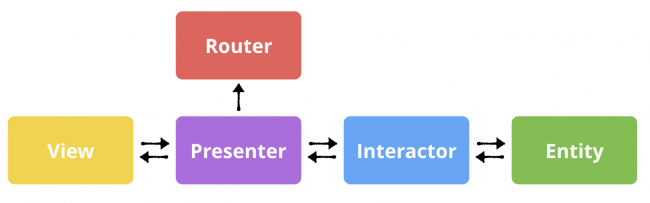

# ItunesSearch
Itunes Search iOS client

## Requirements

- Xcode 15.2

## Dependencies

There is no third-party dependency in this project.

## Structure

**VIPER** is used as the architecture of the project.

Each of the letters in **VIPER** stand for a component of the architecture: View, Interactor, Presenter, Entity and Router.

- The **View** is the user interface. This corresponds to a SwiftUI View.
- The **Interactor** is a class that mediates between the presenter and the data. It takes direction from the presenter.
- The **Presenter** is the “traffic cop” of the architecture, directing data between the view and interactor, taking user actions and calling to router to move the user between views.
- An **Entity** represents application data.

The **Router** handles navigation between screens. That’s different than it is in SwiftUI, where the view shows any new views.

### Diagram of **VIPER**

